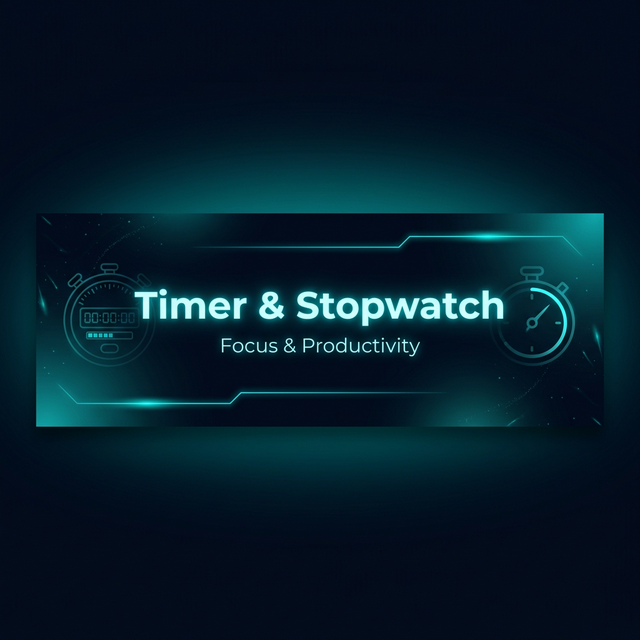
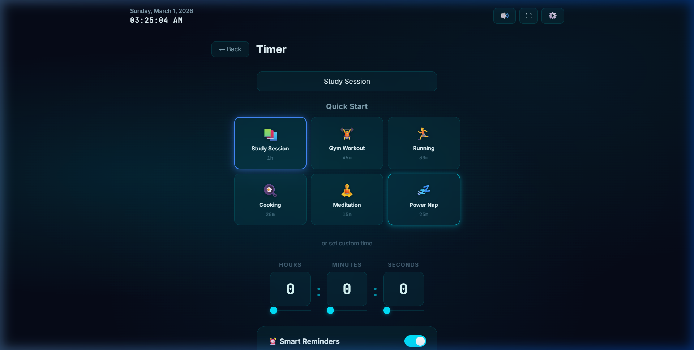
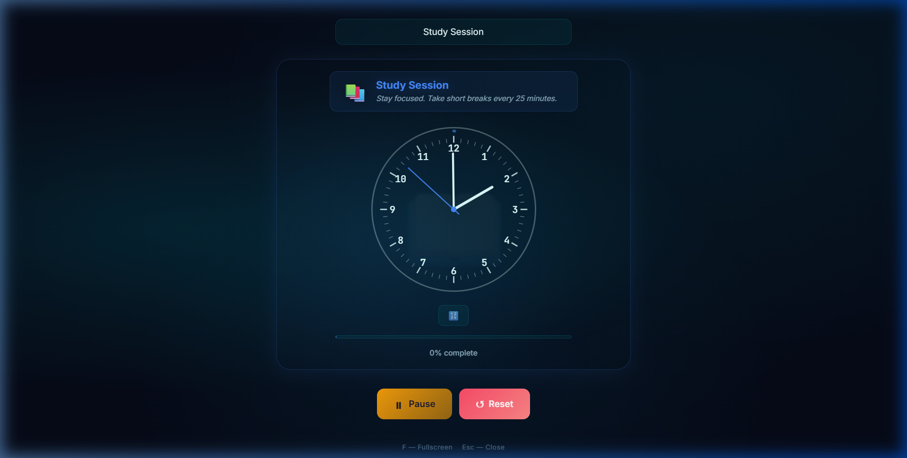
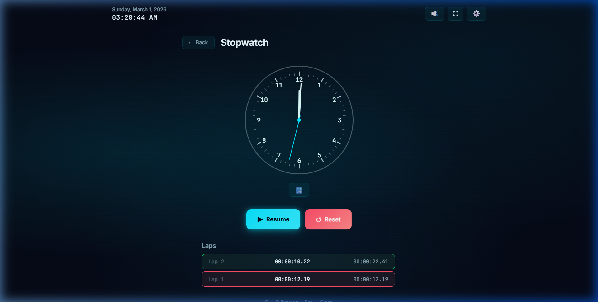

<div align="center">



<br/>

[](https://reactjs.org/)
[](https://vitejs.dev/)
[](https://developer.mozilla.org/en-US/docs/Web/JavaScript)
[](https://developer.mozilla.org/en-US/docs/Web/CSS)
[](https://www.framer.com/motion/)
[](https://github.com/features/actions)
[](LICENSE)

<br/>

> **⚡ A premium, production-grade Timer & Stopwatch built with React.**
> Featuring activity presets, smart reminders, analog/digital clock, themes, confetti celebrations, and buttery-smooth animations — all in a stunning cyan neon glow UI.

<br/>

[🚀 Live Demo](https://techwithabhi.github.io/timer-stopwatch/) · [📖 Features](#-features) · [🎨 Screenshots](#-screenshots) · [🧰 Tech Stack](#-tech-stack) · [🏗️ Getting Started](#%EF%B8%8F-getting-started) · [🤝 Contributing](#-contributing)

</div>

---

## 🎨 Screenshots

<div align="center">

### 🏠 Landing — Mode Selection
Choose between **Stopwatch** and **Timer** with smooth card animations.


<br/><br/>

### ⏳ Timer — Activity Presets
Pick from **6 quick-start presets** (Study, Gym, Running, Cooking, Meditation, Power Nap) or set a custom time.



<br/><br/>

### 📚 Timer — Themed Running View
Each activity gets its **own color scheme, watermark emoji, and motivational tip** during countdown.



<br/><br/>

### ⏱️ Stopwatch — With Lap Tracking
Precision stopwatch with **lap recording**, best/worst lap highlighting, and a clean scrollable panel.



</div>

---

## ✨ Features

### 🎯 Core
| Feature | Description |
|---------|-------------|
| ⏱️ **Stopwatch** | Start, pause, resume, reset with centisecond precision |
| ⏳ **Countdown Timer** | Set custom durations up to 23:59:59 with sliders + inputs |
| 🎬 **Activity Presets** | One-tap quick-start for Study, Gym, Running, Cooking, Meditation, Power Nap |
| 🎨 **Themed Countdown** | Each activity gets unique colors, watermark emoji, and motivational tips |
| 🏁 **Lap Tracking** | Record laps with best (green) / worst (red) highlighting |
| 📛 **Named Timers** | Label your timer (e.g., "Study Session", "Leg Day") |

### 🔔 Smart Features
| Feature | Description |
|---------|-------------|
| ⏰ **Smart Reminders** | Set interval reminders (every N minutes) with sound + motivational popup |
| 🎉 **Completion Celebration** | Confetti animation + success sound when timer hits zero |
| 🕹️ **Keyboard Shortcuts** | `Space` = Start/Pause, `R` = Reset, `F` = Fullscreen |
| 🔇 **Sound Toggle** | Mute/unmute all sounds from the header |
| 🖥️ **Fullscreen Focus** | Distraction-free fullscreen mode |
| 📊 **Progress Bar** | Visual progress indicator during countdown |

### 🎨 Design & UX
| Feature | Description |
|---------|-------------|
| 🌊 **Glassmorphism UI** | Backdrop blur, glass borders, and subtle transparency |
| 💎 **Cyan Neon Glow** | Premium dark theme with vibrant cyan accents and glow effects |
| 🎭 **6 Theme Presets** | Cyan Glow, Neon Blue, Aqua, Electric, Hot Pink, Lime |
| 🎨 **Custom Colors** | Pick any background, clock, and accent color |
| 🔄 **Digital + Analog Clock** | Toggle between digital readout and SVG analog face |
| 📱 **Fully Responsive** | Optimized for mobile, tablet, laptop, and desktop |
| ⚡ **Framer Motion** | Smooth page transitions, card animations, and micro-interactions |
| 🕐 **Live Date & Time** | Always visible in the header |

### 💾 Persistence
All preferences saved to **localStorage**:
- Last selected mode
- Timer name
- Theme colors
- Reminder settings
- Sound preferences

---

## 🧰 Tech Stack

| Technology | Purpose |
|---|---|
| ⚛️ **React 18** | Functional components, hooks, state management |
| ⚡ **Vite** | Lightning-fast dev server & optimized builds |
| 🎞️ **Framer Motion** | Declarative animations & transitions |
| 🎊 **canvas-confetti** | Celebration animation on timer completion |
| 🔊 **Web Audio API** | Programmatic sound generation (no audio files) |
| 🎨 **CSS3** | Custom properties, glassmorphism, responsive grid |
| 💾 **localStorage** | Client-side data persistence |
| 🚀 **GitHub Actions** | Automated build & deployment to GitHub Pages |

---

## 📁 Project Structure

```
timer-stopwatch/
├── .github/workflows/
│   └── deploy.yml              # GitHub Pages auto-deploy
├── images/                     # README screenshots & banner
├── src/
│   ├── components/
│   │   ├── Header.jsx          # Live clock, sound toggle, fullscreen, settings
│   │   ├── ModeSelector.jsx    # Landing page — Stopwatch vs Timer cards
│   │   ├── Stopwatch.jsx       # Stopwatch with lap tracking
│   │   ├── Timer.jsx           # Countdown timer with presets & themes
│   │   ├── ClockDisplay.jsx    # Digital & SVG analog clock faces
│   │   ├── Controls.jsx        # Reusable Start/Pause/Reset button bar
│   │   ├── ReminderSystem.jsx  # Interval reminder configuration
│   │   ├── CompletionOverlay.jsx # Confetti celebration screen
│   │   └── SettingsPanel.jsx   # Theme presets & custom color pickers
│   ├── hooks/
│   │   └── useLocalStorage.js  # Custom hook for persistent state
│   ├── utils/
│   │   ├── audio.js            # Web Audio API sound generation
│   │   └── time.js             # Time formatting, parsing & validation
│   ├── App.jsx                 # Root — routing, theme, keyboard shortcuts
│   ├── index.css               # Design system — tokens, glassmorphism, responsive
│   └── main.jsx                # React entry point
├── index.html                  # HTML shell with SEO meta tags
├── vite.config.js              # Vite config with GitHub Pages base path
└── package.json
```

---

## 🏗️ Getting Started

### Prerequisites

- [Node.js](https://nodejs.org/) `v16+`
- [npm](https://www.npmjs.com/) `v7+`

### Installation

```bash
# Clone the repository
git clone https://github.com/Techwithabhi/timer-stopwatch.git
cd timer-stopwatch

# Install dependencies
npm install

# Start the development server
npm run dev
```

The app will be running at **http://localhost:5173** 🎉

### Available Scripts

| Command | Description |
|---|---|
| `npm run dev` | Start Vite dev server with HMR |
| `npm run build` | Build for production → `/dist` |
| `npm run preview` | Preview production build locally |
| `npm run lint` | Run ESLint across all source files |

---

## ⌨️ Keyboard Shortcuts

| Key | Action |
|-----|--------|
| `Space` | Start / Pause |
| `R` | Reset |
| `F` | Toggle fullscreen |
| `L` | Record lap (Stopwatch) |

---

## 🚀 Deployment

This project auto-deploys to **GitHub Pages** via GitHub Actions on every push to `main`.

**Live URL:** [https://techwithabhi.github.io/timer-stopwatch/](https://techwithabhi.github.io/timer-stopwatch/)

### Manual Deploy

```bash
npm run build
git add dist -f
git commit -m "Deploy"
git subtree push --prefix dist origin gh-pages
```

---

## 🤝 Contributing

```bash
# 1. Fork and clone
git clone https://github.com/YOUR_USERNAME/timer-stopwatch.git

# 2. Create a feature branch
git checkout -b feature/your-feature-name

# 3. Make your changes and commit
git commit -m "feat: add your feature"

# 4. Push and open a Pull Request
git push origin feature/your-feature-name
```

---

## 📄 License

This project is licensed under the **MIT License**.

---

<div align="center">

Made with ❤️ by [Techwithabhi](https://github.com/Techwithabhi)

⭐ **Star this repo if you found it helpful!** ⭐

</div>
